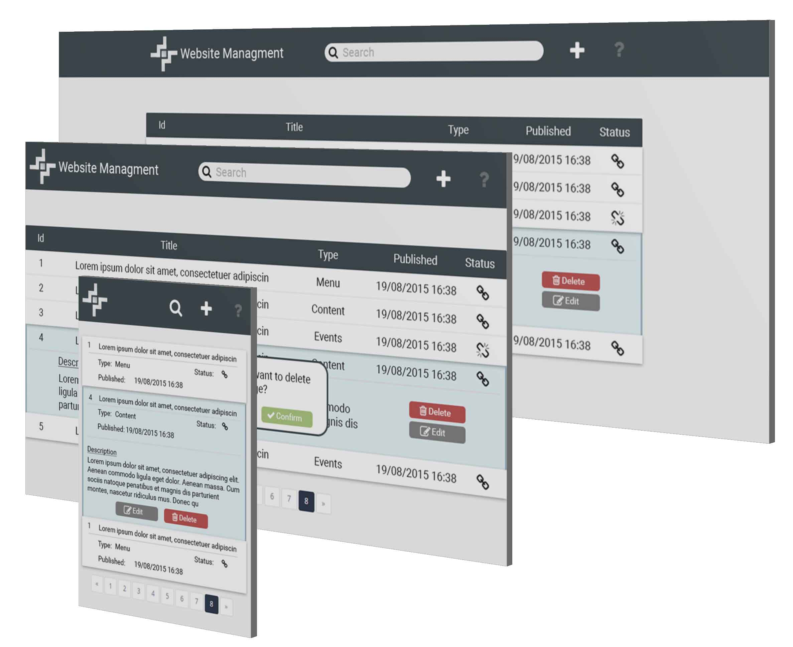

## Project: Website Management


### Contents
1. [Designing the solution](#designing-the-solution)
2. [Setting up the Dev-Enviroment](#setting up the Dev-Enviroment)
3. [Building the app](#building-the-app)


### Designing the Solution
##### The application

It is a single page app that lets the user manage his/her website's pages.

##### User Experience
The user should be able to:
* See all the existing pages
* Create a new page
* Modify an existing page
* Delete a page

Bonus:
The user will also be available to search and navigate through his/her pages.


##### Static Graphic Design
First i created a static design of the application considering the UX.
The application will be responsive.
I also made a simple logo so it can look more realistic.



### Setting up the Dev-Enviroment
To set up the dev-enviroment first i must decide what tools i will use.

For CSS i will use SASS, and PostCSS to take care of the processing more efficiently.
As the application's architecture i will use Flux. The main frameworks/libraries that i will use will be React for handling the views of the data and qwest to handle the requests. To handle all this tasks i will use gulp.

Gulp will:

* Compile and minify the code into plain javascript and css
* Notify of any errors
* Run the server and update when any change happens to the code

### Building the app

Overview:

*Coming Soon*


#### Installation

```
 npm install
```
#### Development
Builds the application and starts a webserver with browsersync. Just gulp and enjoy!
```
gulp
```
Made with ♥ by James Gatz [@jamesgatzos](https://twitter.com/jamesgatzos)
